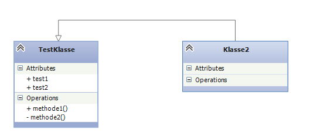

Mögliche UML Tools
====

Umbrello
----
Die KDE-Lösung für UML Diagramme, scheint sehr umfangreich und vollständig zu sein. Läuft laut Website auch unter Windows, werde es vorerst nur unter Linux testen.  

+ Nachteil: scheint wohl recht buggy zu sein, zumindest laut den Kommentaren online --> im ersten Test kein Problem
+ Vorteil: Generiert auch Python Code --> vielleicht nen versuch wert.
+ Vorteil: Importiert auch schon vorhandenen Code in übersichtliche Diagramme --> Wie gut das funktioniert ist die Frage... --> geht sogar. könnte man in Betracht ziehen.
+ Vorteil: Export in viele andere Formate
+ In allen [Screenshots](http://umbrello.kde.org/screenshots.php) keine anderen Diagrammtypen
+ Habe viele Klicks gebraucht, um etwas hinzukriegen, habe nicht hingekriegt, was ich wollte :D
+ Erstellt Automatisch Verbindungen, wenn eine Klasse als Typ verwendet wird
+ Ich sehe unlösbare Merge-Konflikte durch recht unübersichtliche Verwendung von IDs in der gespeicherten xmi Datei

Visual Studio Lösung
----
Scheint auch recht gut zu sein, ist halt Microsoft. D.h. kein Export in andere Formate (soweit gesehen), Ansicht fest vorgegeben (siehe Screenshot)  

+ [das muss doch nicht](http://msdn.microsoft.com/en-us/library/ff469815.aspx)
+ (IMHO - emka) typisches VS Verhalten, sprich Einarbeitungszeit für *flüssiges* Arbeiten vorausgesetzt :D
+ ev. noch weitere infos sammeln 

[draw.io](http://draw.io/)
----
+ Online, Platform unabhängig
+ Scheint auch viele Diagrammtypen zu ermöglichen (Sequenzdiagramme, etc.)
+ Vorteil: Export in viele Formate (Grafiken, Vektor, pdf, xml)
+ [Nachteil: beschränkte Menge an Vorlagen, ev. fehlen solche, die wir dringend brauchen würden.] Leeres Diagramm, Bausteine sehe ich genug
+ (Auch) nicht verteilt bearbbeitbar (erzeugt primär ein komprimiertes xml Format - auch als ausführliches xml nicht unbedingt gut lesbar)
+ Hier bitte noch weiter nachforschen!

[UMLet](http://www.umlet.com/)
----
+ Multiplatform, sogar portable
+ Schönes XML Exportformat, macht offenbar mergen möglich!
+ Viele Exportmöglichkeiten in alle relevanten Formate
+ Nachteil: Ich sehe nicht so einfach die Möglichkeit von Sequenzdiagrammen o.Ä., [scheint aber möglich zu sein](http://www.itmeyer.at/umlet/uml2/)
+ (Emfpehlung durch andere Gruppe :D )
  
  
Es gibt weitere Tools, die aus UML auch Python-Quellcode erzeugen bzw. auch andersherum. Hab mir jedoch einige angeschaut, aber die waren alle völlig veraltet und nicht mehr aktuell --> vielleicht findet man da noch was besseres.